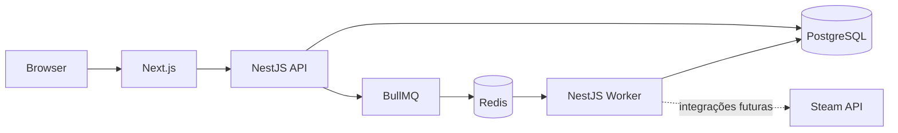

# Arquitetura do PartyQueue

O MVP começa como um monólito modular TypeScript com um worker separado. Essa divisão mantém o domínio simples de operar e permite que sincronizações externas sejam executadas fora do ciclo HTTP.



## Componentes iniciais

- `apps/web`: interface Next.js com App Router.
- `apps/api`: API REST NestJS com prefixo `/api/v1`.
- `apps/worker`: processo NestJS standalone para tarefas assíncronas futuras.
- `packages/database`: schema, migrations e client Prisma.
- `packages/contracts`: schemas e tipos compartilhados nos limites da aplicação.
- `packages/ranking`: futuro motor determinístico, puro e versionado.
- `packages/config`: configurações TypeScript compartilhadas.

PostgreSQL é a fonte de verdade. Redis persiste filas e estado técnico efêmero; BullMQ coordena a entrega dos jobs entre API e worker. Votos, grupos, sessões e bibliotecas continuam no PostgreSQL.

## Fluxo assíncrono

```text
POST /api/v1/jobs/ping
  → API adiciona job no BullMQ
  → BullMQ persiste o job no Redis
  → worker busca e processa o job
  → resultado e estado técnico permanecem no Redis pelo período configurado
```

O endpoint de ping existe como prova de infraestrutura. Os próximos jobs reais serão sincronização de perfil e biblioteca Steam.

## Containers

O Compose possui dois modos:

- `docker compose up -d`: somente PostgreSQL e Redis; apps rodam com `pnpm dev`.
- `docker compose --profile app up --build`: stack completa em containers.

Volumes nomeados preservam dados entre reinícios. Healthchecks evitam iniciar os apps antes de PostgreSQL e Redis estarem prontos.
